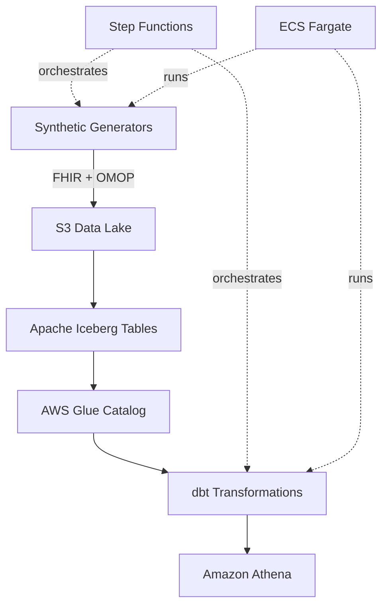

# FHIR-OMOP Synthetic Stack

A fully deployable **AWS-based reference architecture** for generating, validating, harmonizing, and transforming **synthetic FHIR + OMOP CDM** data using modern data lakehouse patterns.

[](https://opensource.org/licenses/MIT)
[](https://www.python.org/downloads/)
[](https://aws.amazon.com/cdk/)

## Overview

This project demonstrates a complete healthcare data pipeline that:
- Generates **correlated synthetic FHIR and OMOP data**
- Validates data quality and cross-model consistency
- Stores data in **Apache Iceberg tables** on S3
- Transforms data using **dbt** with lineage tracking
- Orchestrates workflows via **AWS Step Functions**
- Queries data through **Amazon Athena**

**Designed for:**
- Healthcare data engineering teams
- AI/ML feature engineering pipelines
- FHIR/OMOP harmonization R&D
- Analytics platform prototyping
- Learning modern data lakehouse patterns

## Architecture



## Features

### 🔬 Synthetic Data Layer
- **Unified Generator**: Creates correlated FHIR and OMOP data
- **Domain Constraints**: Medical logic and validation rules
- **Terminology Enforcement**: OMOP concept IDs and FHIR codes
- **Cross-Model Validation**: Ensures FHIR ↔ OMOP consistency

### 💾 Storage & Modeling
- **Apache Iceberg** tables on S3
- **AWS Glue Catalog** for metadata
- **dbt** staging, marts, and metrics layers
- **Lineage tracking** with PIPELINE_RUN_ID

### 🔄 Orchestration
- **AWS Step Functions** pipeline
- **ECS Fargate** for containerized tasks
- **PIPELINE_RUN_ID** propagation for full lineage

### 🔒 Security & Governance
- **KMS encryption** for data at rest
- **VPC endpoints** for private networking
- **IAM least privilege** policies
- **Security groups** for network isolation

## Prerequisites

- **AWS Account** with appropriate permissions
- **AWS CLI v2** configured
- **Node.js 20+** for CDK
- **Python 3.11+**
- **uv** (recommended) or pip
- **Docker** (optional, for local testing)
- **bd (beads) CLI** for issue tracking - See [Installation Guide](docs/development/beads-installation.md)

## Quick Start

### 1. Local Testing (No AWS Required)

Generate and validate synthetic data locally:

```bash
# Install dependencies
uv sync

# Generate 10 correlated patients
uv run python synthetic/generators/unified_generator.py \
  --count 10 \
  --fhir-dir ./output/fhir \
  --omop-dir ./output/omop

# Flatten FHIR to Parquet
uv run python synthetic/etl/flatten_fhir.py \
  --input-dir ./output/fhir \
  --output-file ./output/fhir/fhir_patient_flat.parquet \
  --bundle

# Validate cross-model consistency
uv run python synthetic/scripts/validate_cross_model.py \
  --omop-dir ./output/omop \
  --fhir-dir ./output/fhir
```

### 2. Run Smoke Test

```bash
./scripts/smoke-test.sh
```

Expected output: ✅ All files generated and validated successfully

### 3. Deploy to AWS (Optional)

```bash
# Install CDK dependencies
cd cdk
npm install

# Bootstrap CDK (first time only)
npx cdk bootstrap

# Deploy infrastructure
npx cdk deploy

# Trigger pipeline
aws stepfunctions start-execution \
  --state-machine-arn <your-state-machine-arn>
```

### 4. Run dbt Locally

```bash
cd dbt/fhir_omop_dbt

# Install dbt dependencies
dbt deps --profiles-dir .

# Load seed data
dbt seed --profiles-dir . --target dev

# Run transformations
dbt run --profiles-dir . --target dev

# Run tests
dbt test --profiles-dir . --target dev
```

## Project Structure

```
synthetic-healthlake/
├── synthetic/              # Data generation and ETL
│   ├── generators/         # FHIR, OMOP, and unified generators
│   ├── etl/               # Flattening and conversion scripts
│   ├── scripts/           # Validation and constraint scripts
│   └── config/            # Domain constraints and mappings
├── dbt/fhir_omop_dbt/     # dbt transformations
│   ├── models/            # Staging, marts, and metrics
│   ├── macros/            # Lineage and utility macros
│   └── seeds/             # Reference data
├── cdk/                   # AWS infrastructure
│   └── lib/               # CDK stack definitions
├── docker/                # Container definitions
├── scripts/               # Pipeline and test scripts
└── tests/                 # Unit and integration tests
```

## Documentation

- **[Local Development Guide](docs/development/LOCAL_DEVELOPMENT.md)** - Set up and run locally
- **[AWS Deployment Guide](docs/deployment/AWS_DEPLOYMENT.md)** - Deploy to AWS
- **[Architecture Overview](docs/architecture/OVERVIEW.md)** - System design
- **[Getting Started Tutorial](docs/tutorial/GETTING_STARTED.md)** - Step-by-step walkthrough
- **[FAQ](docs/FAQ.md)** - Common questions and troubleshooting

## Key Achievements

✅ **Correlated Data Generation** - FHIR and OMOP data perfectly aligned  
✅ **PIPELINE_RUN_ID Integration** - Full lineage from Step Functions to dbt  
✅ **Cross-Model Validation** - 100% consistency between FHIR and OMOP  
✅ **End-to-End Testing** - Smoke test validates entire pipeline  
✅ **Production-Ready Infrastructure** - KMS, VPC endpoints, monitoring  

## Development

### Running Tests

```bash
# Python unit tests
uv run pytest tests/ -v

# Smoke test (integration)
./scripts/smoke-test.sh

# CDK tests
cd cdk && npm test
```

### Building Docker Images

```bash
# Synthetic generator
docker build -f docker/synthetic-generator/Dockerfile -t synthetic-generator .

# dbt runner
docker build -f docker/dbt-runner/Dockerfile -t dbt-runner .

# Test with docker-compose
cd docker && docker-compose up
```

## Troubleshooting

### Import Errors
If you see `ModuleNotFoundError: No module named 'synthetic'`, ensure you've run:
```bash
uv sync
```

### dbt Compilation Errors
Ensure you're using the correct profile:
```bash
dbt compile --profiles-dir . --target dev
```

### AWS Permissions
The deploying user needs permissions for:
- CloudFormation, S3, Glue, Athena, ECS, Step Functions, VPC, KMS, IAM

See [AWS Deployment Guide](docs/deployment/AWS_DEPLOYMENT.md) for details.

## Contributing

This is a reference architecture for learning and prototyping. Feel free to:
- Fork and customize for your use case
- Submit issues for bugs or questions
- Share improvements via pull requests

## License

MIT License - see [LICENSE](LICENSE) for details

## Acknowledgments

Built with:
- [AWS CDK](https://aws.amazon.com/cdk/)
- [dbt](https://www.getdbt.com/)
- [Apache Iceberg](https://iceberg.apache.org/)
- [Faker](https://faker.readthedocs.io/)

---

**Status**: ~70% complete as reference architecture  
**Last Updated**: 2025-12-02  
**Phases Complete**: 1-5 (Infrastructure, Core Logic, Pipeline, Testing)  
**Next**: Phase 6 (Documentation), Phase 7 (Security), Phase 8 (Polish)
