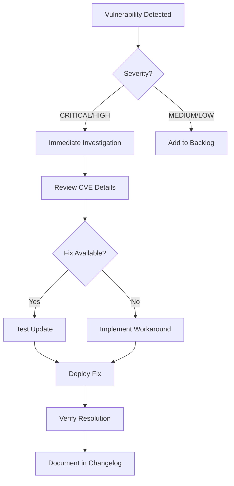

# Dependency Scanning

This document describes the automated dependency scanning and security monitoring setup for the synthetic-healthlake project.

## Overview

The project uses multiple tools to identify and manage security vulnerabilities in dependencies:

- **Dependabot**: Automated dependency updates
- **pip-audit**: Python package vulnerability scanning
- **npm audit**: Node.js package vulnerability scanning
- **Safety**: Additional Python security checks
- **Trivy**: Container and filesystem vulnerability scanning
- **Bandit**: Python code security linting

## Dependabot Configuration

Dependabot is configured to automatically check for dependency updates across multiple ecosystems:

### Monitored Ecosystems

1. **Python (pip)** - Main project dependencies
2. **Node.js (npm)** - CDK infrastructure code
3. **GitHub Actions** - CI/CD workflow dependencies
4. **Docker** - Container base images

### Configuration Details

- **Schedule**: Weekly on Mondays at 9:00 AM PST
- **Grouping**: Minor and patch updates are grouped to reduce PR noise
- **Labels**: Automatic labeling for easy filtering
- **Security Updates**: Enabled for all dependency types

### Managing Dependabot PRs

```bash
# Review Dependabot PRs
gh pr list --label dependencies

# Auto-merge minor/patch updates (after CI passes)
gh pr merge <PR_NUMBER> --auto --squash

# Review security updates immediately
gh pr list --label security
```

## Automated Scanning (CI/CD)

### GitHub Actions Workflow

The `dependency-scan.yml` workflow runs on:

- Push to main/master branches
- Pull requests
- Weekly schedule (Mondays at 9 AM UTC)
- Manual trigger via workflow_dispatch

### Scan Jobs

#### 1. Python Security Scan (pip-audit)

Scans Python dependencies for known vulnerabilities:

```yaml
- Uses: pip-audit
- Format: JSON and Markdown
- Outputs: Uploaded as artifacts
- Fails on: Any vulnerabilities found
```

#### 2. Node.js Security Scan (npm audit)

Scans Node.js dependencies in the CDK project:

```yaml
- Uses: npm audit
- Threshold: Fails on HIGH or CRITICAL vulnerabilities
- Format: JSON and text
- Outputs: Uploaded as artifacts
```

#### 3. Python Safety Check

Additional Python security scanning:

```yaml
- Uses: safety
- Database: PyUp.io vulnerability database
- Format: JSON and text
- Outputs: Uploaded as artifacts
```

#### 4. Trivy Scan

Comprehensive vulnerability scanning:

```yaml
- Uses: aquasecurity/trivy-action
- Scans: Filesystem, dependencies, misconfigurations
- Severity: CRITICAL, HIGH, MEDIUM
- Output: SARIF format for GitHub Security tab
```

### Viewing Scan Results

1. **GitHub Actions Summary**: View results in the workflow run summary
2. **Artifacts**: Download detailed reports from workflow artifacts
3. **Security Tab**: View Trivy SARIF results in GitHub Security tab
4. **Annotations**: Vulnerabilities appear as annotations on PRs

## Local Scanning

### Quick Scan Script

Use the provided convenience script to run all security scans locally:

```bash
./scripts/security-scan.sh
```

### Manual Scanning

#### Python Dependencies (pip-audit)

```bash
# Install security tools
uv pip install -e ".[security]"

# Scan for vulnerabilities
pip-audit

# Output formats
pip-audit --format json --output report.json
pip-audit --format markdown --output report.md
pip-audit --desc  # Include vulnerability descriptions

# Fix vulnerabilities (when possible)
pip-audit --fix
```

#### Python Security (Safety)

```bash
# Install safety
uv pip install safety

# Run security check
safety check

# Output formats
safety check --json --output safety-report.json
safety check --full-report

# Check specific requirements file
safety check -r requirements.txt
```

#### Python Code Security (Bandit)

```bash
# Install bandit
uv pip install bandit

# Scan specific directories
bandit -r health_platform/
bandit -r synthetic/

# Generate report
bandit -r . -f json -o bandit-report.json

# Configuration in pyproject.toml
```

#### Node.js Dependencies (npm audit)

```bash
# Navigate to CDK directory
cd cdk

# Run audit
npm audit

# Show only high/critical vulnerabilities
npm audit --audit-level=high

# Attempt automatic fixes
npm audit fix

# Force fixes (may introduce breaking changes)
npm audit fix --force

# Generate detailed report
npm audit --json > npm-audit-report.json
```

#### Trivy Scan

```bash
# Install Trivy (macOS)
brew install aquasecurity/trivy/trivy

# Scan filesystem
trivy fs .

# Scan with specific severity
trivy fs --severity HIGH,CRITICAL .

# Generate report
trivy fs --format json --output trivy-report.json .

# Scan Docker images
trivy image <image-name>
```

## Pre-commit Hooks

Security checks run automatically on every commit:

```bash
# Install pre-commit hooks
pre-commit install

# Run manually
pre-commit run --all-files

# Update hooks to latest versions
pre-commit autoupdate
```

### Included Security Hooks

1. **detect-private-key**: Prevents committing private keys
2. **bandit**: Python code security linting
3. **pip-audit**: Checks for vulnerable dependencies (requires hashes)

## Responding to Vulnerabilities

### Priority Levels

1. **CRITICAL**: Immediate action required
   - Update within 24 hours
   - Consider hotfix if in production

2. **HIGH**: Urgent action needed
   - Update within 1 week
   - Review and test thoroughly

3. **MEDIUM**: Plan update
   - Update in next sprint
   - Monitor for exploitation

4. **LOW**: Monitor
   - Update when convenient
   - Consider in regular maintenance

### Response Workflow



### Update Process

1. **Assess Impact**:
   - Review CVE details
   - Check if vulnerability is exploitable in your context
   - Identify affected components

2. **Test Update**:

   ```bash
   # Create test branch
   git checkout -b security/fix-cve-xxxx

   # Update dependency
   uv pip install --upgrade <package>

   # Run tests
   pytest
   npm test

   # Run security scans
   ./scripts/security-scan.sh
   ```

3. **Deploy**:
   - Create PR with security label
   - Fast-track review for critical issues
   - Deploy after CI passes

4. **Verify**:
   - Re-run security scans
   - Confirm vulnerability is resolved
   - Monitor for side effects

## Best Practices

### 1. Regular Updates

- Review Dependabot PRs weekly
- Keep dependencies up to date
- Don't let updates accumulate

### 2. Security-First Culture

- Treat security updates as high priority
- Test security updates promptly
- Document security decisions

### 3. Dependency Management

- Minimize dependency count
- Prefer well-maintained packages
- Review transitive dependencies
- Pin versions in production

### 4. Monitoring

- Enable GitHub security alerts
- Subscribe to security advisories
- Monitor CVE databases for your stack

### 5. Documentation

- Document known vulnerabilities
- Track false positives
- Maintain security changelog

## Configuration Files

### Dependabot

```yaml
# .github/dependabot.yml
version: 2
updates:
  - package-ecosystem: "pip"
    directory: "/"
    schedule:
      interval: "weekly"
```

### Bandit

```toml
# pyproject.toml
[tool.bandit]
exclude_dirs = ["tests", "venv", ".venv", "cdk.out"]
skips = ["B101"]
```

### pip-audit

```bash
# .pre-commit-config.yaml
- repo: https://github.com/pypa/pip-audit
  rev: v2.6.1
  hooks:
    - id: pip-audit
      args: [--require-hashes, --disable-pip]
```

## Troubleshooting

### pip-audit fails in CI

**Issue**: pip-audit reports vulnerabilities that can't be fixed

**Solution**:

```bash
# Generate ignore file
pip-audit --format json > vulns.json

# Review each vulnerability
# Add to .pip-audit-ignore.json if false positive
```

### npm audit reports unfixable vulnerabilities

**Issue**: npm audit shows vulnerabilities with no available fix

**Solution**:

```bash
# Check if dev dependency
npm audit --production

# Generate exceptions file
npm audit --json > audit-exceptions.json

# Document reason in security docs
```

### Dependabot creates too many PRs

**Issue**: Overwhelming number of dependency PRs

**Solution**:

- Use grouping in dependabot.yml
- Adjust open-pull-requests-limit
- Set up auto-merge for minor updates
- Increase schedule interval to monthly

### Pre-commit hooks too slow

**Issue**: Security checks slow down commits

**Solution**:

```bash
# Skip hooks temporarily (not recommended)
git commit --no-verify

# Or run only specific hooks
pre-commit run bandit --all-files

# Or disable pip-audit in pre-commit (still runs in CI)
```

## Additional Resources

- [pip-audit Documentation](https://pypi.org/project/pip-audit/)
- [npm audit Documentation](https://docs.npmjs.com/cli/v8/commands/npm-audit)
- [Dependabot Documentation](https://docs.github.com/en/code-security/dependabot)
- [Trivy Documentation](https://aquasecurity.github.io/trivy/)
- [Bandit Documentation](https://bandit.readthedocs.io/)
- [Safety Documentation](https://pyup.io/safety/)
- [OWASP Dependency Check](https://owasp.org/www-project-dependency-check/)

## Related Documents

- [Security Checklist](security-checklist.md)
- [Security Policy](../security.md)
- [Contributing Guidelines](../../CONTRIBUTING.md)
- [Incident Response Plan](threat-model.md)
